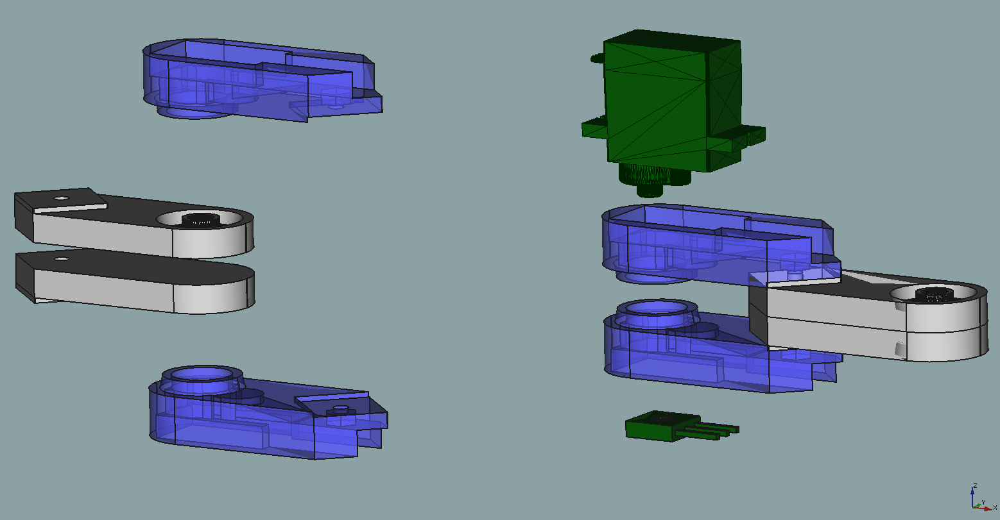
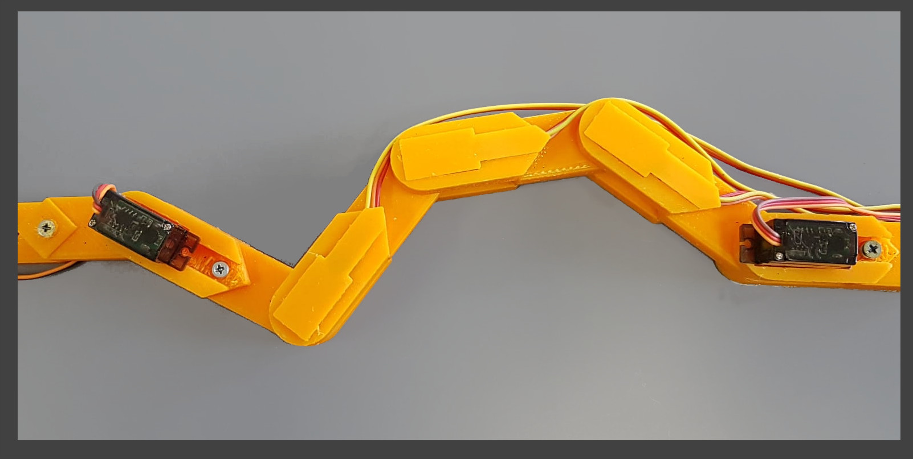
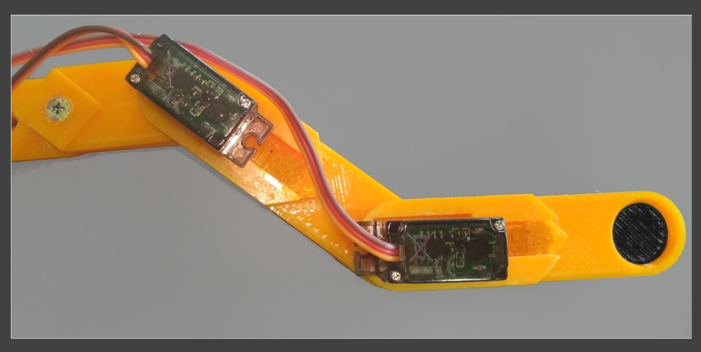

# Easy Planar Robot Labs

These files allow to build or to simulate different planar robot architectures. The 3D pieces are intended to be user as modular arms that can be conected in a sequence. There are arms to be used as pivots, for example, to stablish a fixed origin.  The maximum number of arms depends on the strength of the servos, the architecture and the needs of the user. The servos used are 9g servos: (23 × 12.2 x 29)mm, the rotation sensors are single turn, vertical potentiometers: (10x10x5)mm. 

To use the simulation software is needed the Jama-1.0.3.jar Java Matrix package and also the Easy Java Javascript Simulations tool https://fem.um.es/Ejs/.

## Closed Chains

### The 4R robot

It is based on the analysis of the geometry of the closed loop structure. It is a  1 DOF planar robot with four rotational joints (4R), is usually called the 4R linkage, and has two fixed pivots. The mathematical model can be obtained using common kinematics analysis.

### The 5R robot

The 5R linkage simulation is based also on the analysis of the geometry of the closed loop structure. It uses two inputs for the two rotational joints.  It is a 2 DOFs planar robot with five rotational joints (5R).

## Open chain

### The NR robot

A planar manipulator with a variable number of DOF (NR). This architecture is not a closed chain of joints, and the minimum example is a 2 DOFs, two joints planar robot. The arm distances are fixed and the system contains only rotational joints. The mathematical model can be obtained using mathematics. 
